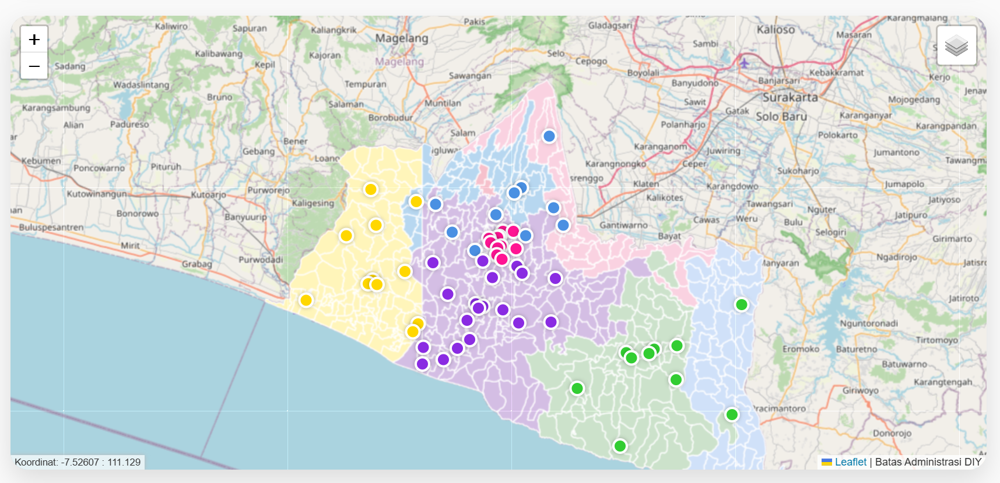
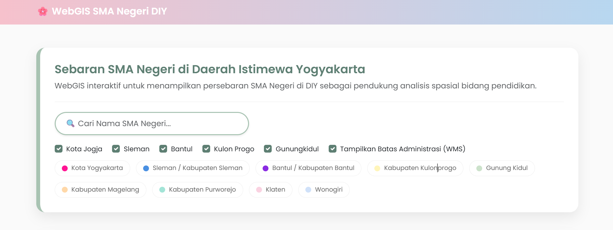
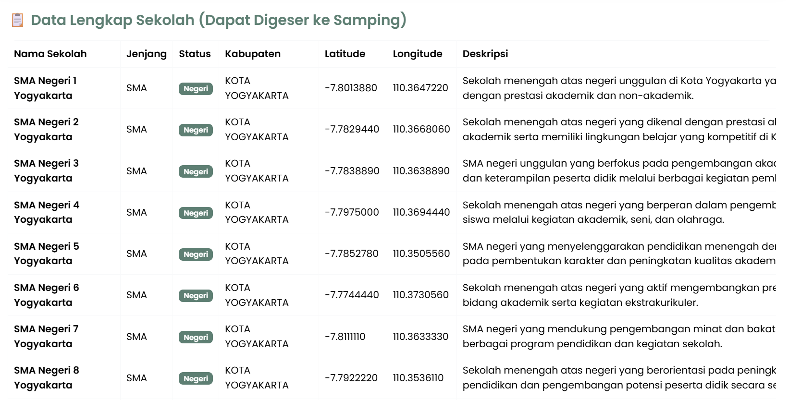

# WebGIS SMA Negeri Daerah Istimewa Yogyakarta

## Deskripsi Produk
WebGIS SMA Negeri Daerah Istimewa Yogyakarta merupakan aplikasi WebGIS interaktif yang digunakan untuk menampilkan persebaran SMA Negeri di wilayah DIY. Aplikasi ini menyajikan informasi lokasi sekolah dalam bentuk peta interaktif dan tabel data, sehingga memudahkan pengguna dalam melakukan eksplorasi dan analisis spasial di bidang pendidikan.

Fitur utama yang tersedia meliputi pencarian nama sekolah, filter berdasarkan kabupaten/kota, tampilan batas administrasi menggunakan layanan WMS, serta informasi detail setiap sekolah melalui popup dan modal.

---

## Teknologi Pembangun Produk
Produk WebGIS ini dibangun menggunakan beberapa teknologi sebagai berikut:
- **HTML5** : Struktur halaman web
- **CSS3** : Styling tampilan antarmuka
- **JavaScript** : Logika interaktif aplikasi
- **Bootstrap 5** : Desain responsif antarmuka
- **Leaflet.js** : Library peta interaktif
- **Leaflet Mouse Position** : Menampilkan koordinat kursor
- **PHP** : Menghubungkan data dari database ke WebGIS
- **MySQL** : Penyimpanan data sekolah
- **GeoServer (WMS)** : Penyedia layer batas administrasi DIY
- **OpenStreetMap & Esri World Imagery** : Basemap peta

---

## Sumber Data
Data yang digunakan dalam aplikasi ini meliputi:
- Data lokasi SMA Negeri di Daerah Istimewa Yogyakarta yang disimpan dalam database MySQL
- Data batas administrasi wilayah DIY yang disajikan melalui layanan Web Map Service (WMS) dari GeoServer
- Basemap OpenStreetMap dan Esri World Imagery

---

## Tangkapan Layar Aplikasi
Berikut merupakan beberapa tampilan utama dari aplikasi WebGIS:

### Tampilan Peta Interaktif

### Tampilan Legenda

### Tampilan Tabel Data Sekolah

